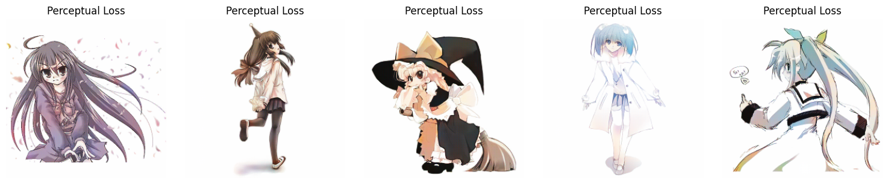

# Manga Colorization Model

This model\'s goal is to colorize manga pages, however, I started from
colorization of simple anime-style illustration.

For training [Anime Sketch Colorization
Pair](https://www.kaggle.com/datasets/ktaebum/anime-sketch-colorization-pair/code)
dataset was used.

### Preprocessing

Colored images were converted to grayscale. I have to chose between
grayscale and line, and grayscale looks closer to manga style. However,
I think the model should be trained on some combination of line +
grayscale art.

Images were normalized to \[-1, 1\] range and resized from 512x512 to
256x256.

``` python
from datasets import SketchDataModule
from utils import show_images
import torch

DEVICE = "cuda" if torch.cuda.is_available() else "cpu"

# Import dataset 
batch_size = 5
dataset = SketchDataModule("../images", batch_size=batch_size, resize=(256, 256), out_ch=3)
test_loader = dataset.test_loader

# show images 
gray, color = next(iter(test_loader))
show_images(color)
```


### The model

The best image generators are trained using Generative Adversarial Networks
(GAN). GAN is a model consisting of two neural networks --- a generator
and a discriminator --- that are trained simultaneously in a game-like
setup:

-   The generator creates fake data (images) from random noise or input
    sketches.
-   The discriminator tries to distinguish between real data and the
    fake data generated.

### Generator

I created several generator architectures that are different from existing one
[model](https://huggingface.co/Keiser41/Example_Based_Manga_Colorization).
The main difference is that for this model, the reference is not needed.

There are 4 architectures for the generator implemented: 1) Simple Unet A
model with 8 convolutional layers with a stride of 2 and 8 transposed
convolutional layers. There are skip connections between 7 of them.


2\) Unet + Self Attention The same as Unet, but there is a trainable
attention layer after the last convolutional layer.


3\) Unet + Pretrained Feature Extractor. The same as Unet, but there is a
frozen Pretrained Feature Extractor. In my case, it is resnet50
[model](https://rf5.github.io/2019/07/08/danbuuro-pretrained.html)
pretrained on danbooru18 dataset. Extracted features are concatenated
with the output of the last convolutional layer.


4\) Unet + Attention + Extractor Unet, where the output of the last conv
layer is concatenated with the feature extraction model output, and then all
1024 goes to self attention layer before transposed conv layers.


### Discriminator

Discriminator I built is designed in such a way that it classifies
patches of an image as real/fake.


### Loss Functions

#### Discriminator loss

Discriminator loss function is binary cross-entropy loss because,
basically, it classifies into 2 classes (real/fake).

#### Generator Loss

Generator loss is a combination of discriminator loss, L1 loss (just an
average absolute difference between predicted values and ground truth)
and optionally perceptual loss. In my model, I tried 3 options.

-   only L1 loss + adversarial loss (how many fake paths dthe iscriminator
    could identify)
-   l1 loss + adversarial loss + perceptual loss based on VGG model
-   l1 loss + adversarial loss + perceptual loss based on VGG model +
    small part of perceptual loss based on pretrained on Danbooru18
    resnet50 model, mentioned above (later refered as \"Anime Loss\").

Perceptual loss measures the difference between high-level features
representations of two images, rather than just comparing pixel values.
When VGG perceptual loss is mostly used, I have thought about combining
it with a 0.1 difference in feature representation of Danbooru18
ResNet50 model.

\\begin{gather*} GeneratorLoss = 0.01 \\cdot AdversarialLoss + 1.0
\\cdot L1Loss + 0.1 \\cdot PerceptualLoss\\ PerceptualLoss = a \\cdot
VGGLoss + (1-a) \\cdot AnimeLoss \\end{gather*}

Each model was trained for 50 epochs, till it produced more or less
reasonable output images. Adam with lr=2e-4 and betas=(0.5, 0.999) was
used as optimizer for both the discriminator and generator.

### The results

#### L1 Loss


#### Perceptual Loss





#### 0.9 Perceptual Loss + 0.1 Anime Loss {#09-perceptual-loss--01-anime-loss}


From all models above model with perceptual loss, attention, and
extractor performs the best on test images. However, if our criteria are
\"vividness\" and \"anime-likeness\" the model with anime loss is
better. However, anime loss should be combined with VGG loss to produce
normal images (without a strange line of pixels at the top).

Unfortunately, I didn't save models correctly only with the extractor,
nevertheless, it performs well on the validation dataset during training. As for
performance on the test dataset, attention generally makes predictions better
in all types of losses. And the feature extractor makes perceptual +
attention model better (but it is not the case for other losses).

Problems:

-   I trained my models only for 50 epochs; more time is needed for
    convergence.
-   The model is designed only for images 256x256, and during training, I
    am resizing the original images (512x512) so they have a worse resolution

Future plans:

-   Train the model on a larger dataset and then fine-tune on manga pages
-   Train the model not on grayscale images but on a mix of grayscale +
    line
-   Add a panel extractor and put each panel into the model separately
-   Add a super-resolution model to get larger and better images

